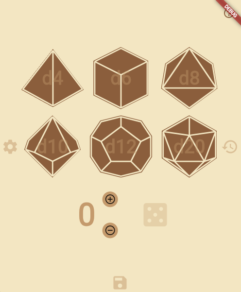

# Dice Roller App

🎲 A modern dice rolling app built with Flutter, featuring smooth animations, sound effects, and an intuitive interface for tabletop RPGs and board games.

## Features

* Multiple Dice Types: Support for standard RPG dice (d4, d6, d8, d10, d12, d20, d100)
* Combination Rolling: Roll multiple dice of different types simultaneously
* Modifier System: Add positive or negative modifiers to your rolls
* Presets: Save and load your favorite dice combinations
* Roll History: Track all your previous rolls with detailed breakdown
* Animated Rolling: Satisfying animations when rolling dice
* Sound Effects: Audio feedback with multiple rolling sound variations
* Various Themes: Choose from various color schemes

## Screenshots



## Installation

### Prerequisites
* Flutter (2.0 or newer)
* Dart (2.12 or newer)

### Setup
1. Clone the repository:
```
git clone https://github.com/leorfernandes/dice-roller-app.git
```

2. Navigate to the project directory:
```
cd dice-roller-app/mobile_dice_rolling
```

3. Install dependencies:
```
flutter pub get
```

4. Run the app:
```
flutter run
```

## How to Use

1. Select Dice: Tap on dice icons to add them to your roll
2. Add Modifiers: Use + and - buttons to adjust the modifier value
3. Roll Dice: Tap the roll button to roll your selected dice
4. Save Presets: Swipe down to access preset management
5. View History: Swipe right to see your roll history
6. Settings: Swipe left to access theme and sound settings

## Technical Details

* Built with Flutter for cross-platform compatibility
* State management using Provider pattern
* Custom animations for dice rolling
* Persistent storage for presets and settings

## Dependencies

* provider: State management
* shared_preferences: Local storage
* audioplayers: Sound playback
* flutter_svg: SVG rendering for dice icons
* url_launcher: External link handling

## Contributing

Contributions are welcome! Please feel free to submit a Pull Request.

1. Fork the repository
2. Create your feature branch (git checkout -b feature/amazing-feature)
3. Commit your changes (git commit -m 'Add some amazing feature')
4. Push to the branch (git push origin feature/amazing-feature)
5. Open a Pull Request

## License

This project is licensed under the MIT License - see the LICENSE file for details.